# Arkikeskus / FsClock

Suomalaiseen kotiin tehty kello-, sää-, sähkönhinta-, liikenne- ja
anturisovellus. Sama koodirunko sisältää kaksi itsenäistä Android-moduulia:

- **`:app`** — FsClock-tablettisovellus (Samsung SM-T819, Tab A9+).
  Kokonäytön kelloruutu, sivutettu ennuste, sadetutka, sähkösivu jne.
- **`:app-mobile`** — Arkikeskus-mobiilisovellus.
  Etusivun widgetit, säähaut, sähkövartit, anturit, liikennetiedotteet,
  GPS-nopeusmittari, kaupunkihaku.

Molemmat moduulit jakavat yhteistä koodia `app/`-moduulista
(`WeatherRepository`, `ElectricityRepository`, `RuuviRepository`,
`SettingsManager` ym.). Mobiili lisää oman puolen koodissaan
`org.jrs82.fsclock.mobile`-pakettiin ja resurssit `app-mobile/src/main/res/`
alle.

## Kuvankaappaukset

Arkikeskus-mobiilisovelluksen näkymiä:

<table>
  <tr>
    <td align="center">
      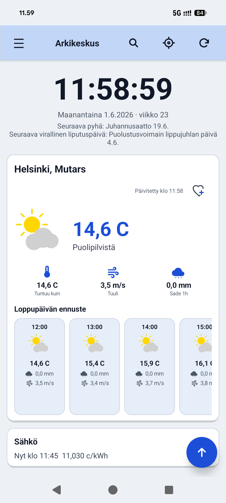<br>
      <sub>Etusivu (vaalea)</sub>
    </td>
    <td align="center">
      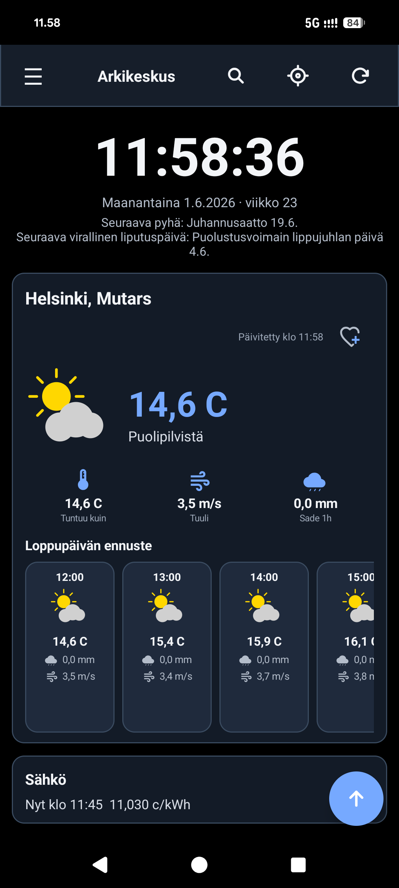<br>
      <sub>Etusivu (tumma)</sub>
    </td>
    <td align="center">
      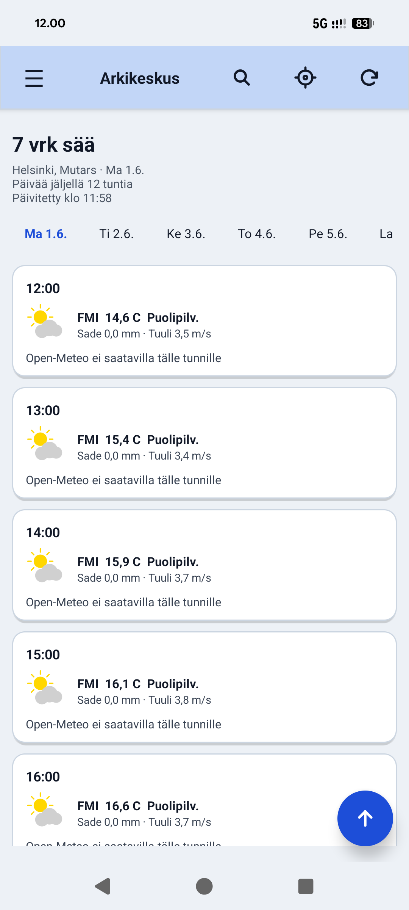<br>
      <sub>7 vrk sää</sub>
    </td>
  </tr>
  <tr>
    <td align="center">
      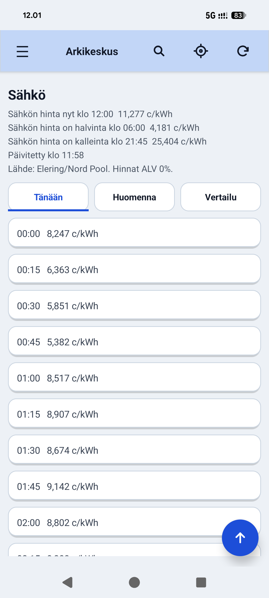<br>
      <sub>Sähkön hinnat</sub>
    </td>
    <td align="center">
      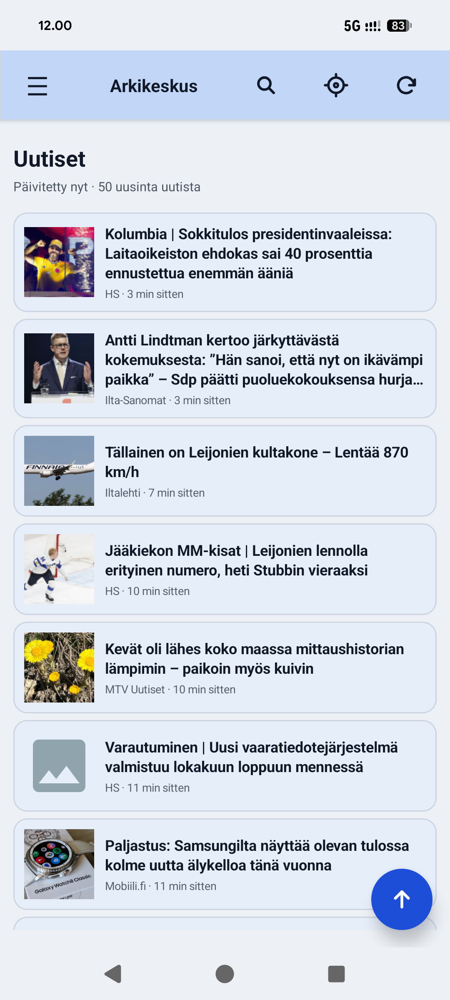<br>
      <sub>Uutiset</sub>
    </td>
    <td align="center">
      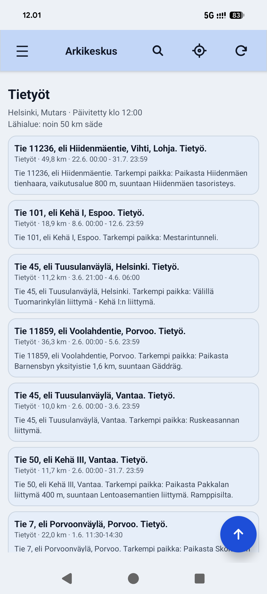<br>
      <sub>Tietyöt</sub>
    </td>
  </tr>
  <tr>
    <td align="center">
      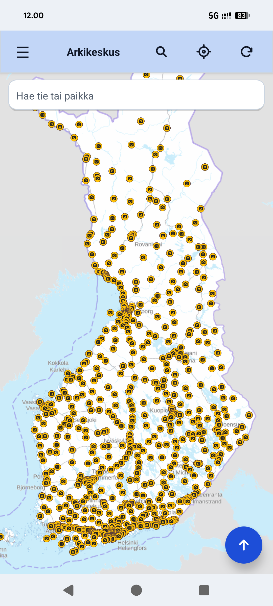<br>
      <sub>Kelikamerat</sub>
    </td>
    <td align="center">
      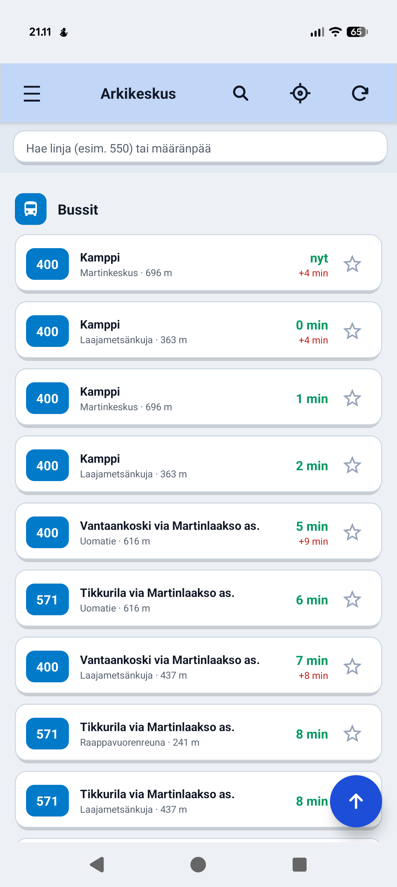<br>
      <sub>Joukkoliikenne (kartta)</sub>
    </td>
    <td align="center">
      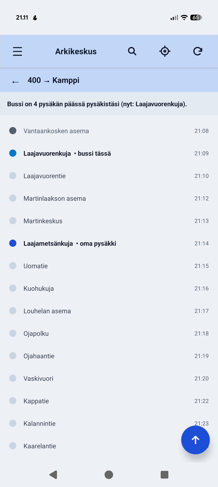<br>
      <sub>Joukkoliikenne (haku)</sub>
    </td>
  </tr>
  <tr>
    <td align="center">
      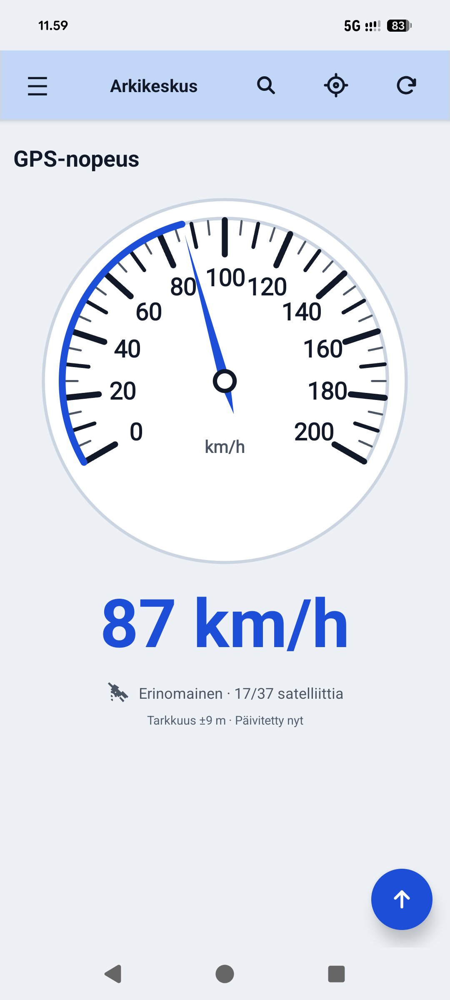<br>
      <sub>GPS-nopeus</sub>
    </td>
    <td align="center">
      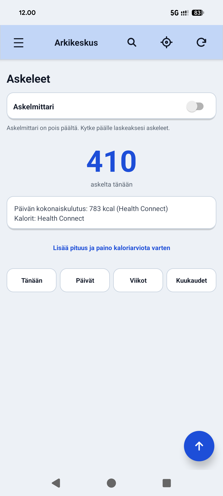<br>
      <sub>Askeleet</sub>
    </td>
    <td align="center">
      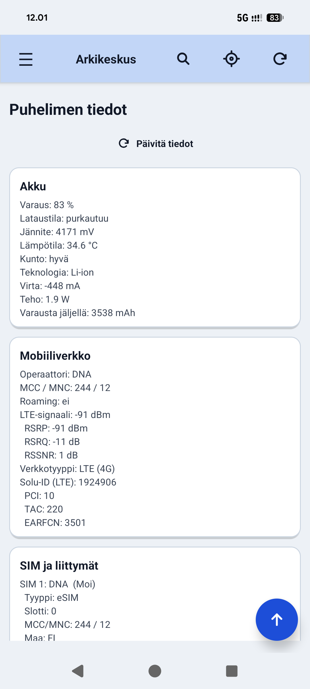<br>
      <sub>Puhelimen tiedot</sub>
    </td>
  </tr>
  <tr>
    <td align="center">
      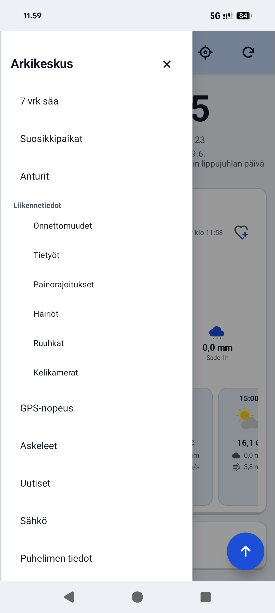<br>
      <sub>Valikko</sub>
    </td>
    <td></td>
    <td></td>
  </tr>
</table>

## Build

Tarvitset Android SDK:n ja Java 17:n. Konfiguroi `local.properties`:

```
sdk.dir=C:\\Users\\<sinä>\\AppData\\Local\\Android\\Sdk
MML_API_KEY=<oma MML-kehittäjäavain>
KEYSTORE_PASSWORD=<release.keystore-salasana, vapaaehtoinen>
KEY_PASSWORD=<avaimen salasana, vapaaehtoinen>
```

MML-avain on ilmaiseksi Maanmittauslaitoksen kehittäjäportaalista. Ilman
sitä paikkahaku ei toimi, mutta sovellus käynnistyy. Allekirjoitukseen
tarvitaan oma `release.keystore` (versionhallinnan ulkopuolella).

### APK:t

```bash
./gradlew :app:assembleRelease           # FsClock-tabletti
./gradlew :app-mobile:assembleRelease    # Arkikeskus-mobiili
```

Tuloksena `app{,-mobile}/build/outputs/apk/release/*.apk`.

## Käytetyt rajapinnat

Kaikki ovat ilmaisia ja vapaita käyttäjäavaimettomia, paitsi MML:

- **FMI** (Finnish Meteorological Institute) — havainnot, ennusteet, varoitukset
- **Open-Meteo** — vertailuennuste
- **Elering Nord Pool** — 15 minuutin sähkönhinnat
- **Digitraffic** — liikennetiedotteet (onnettomuudet, tietyöt, häiriöt)
- **Maanmittauslaitos (MML)** — paikkahaku, geokoodaus (vaatii kehittäjäavaimen)

## Lisenssi

Henkilökohtaiseen käyttöön, ei kaupallista jakelua.
